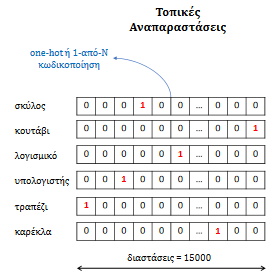
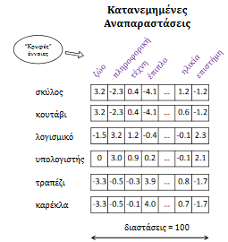
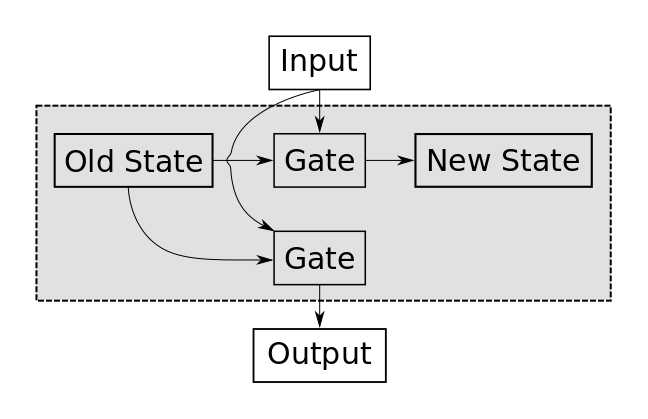
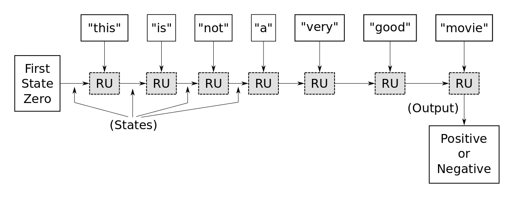
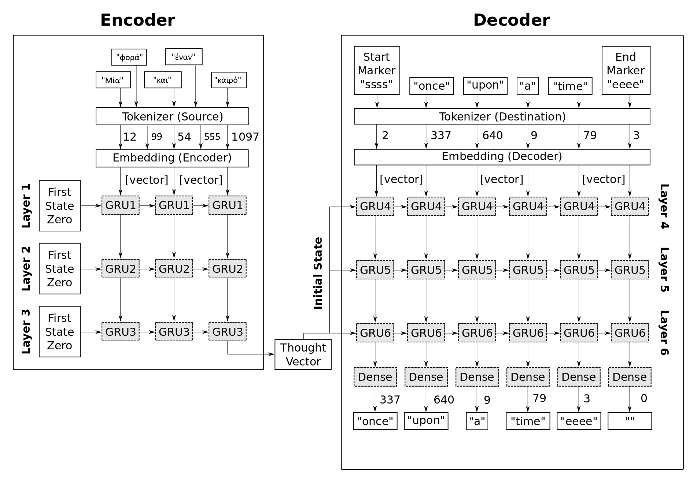
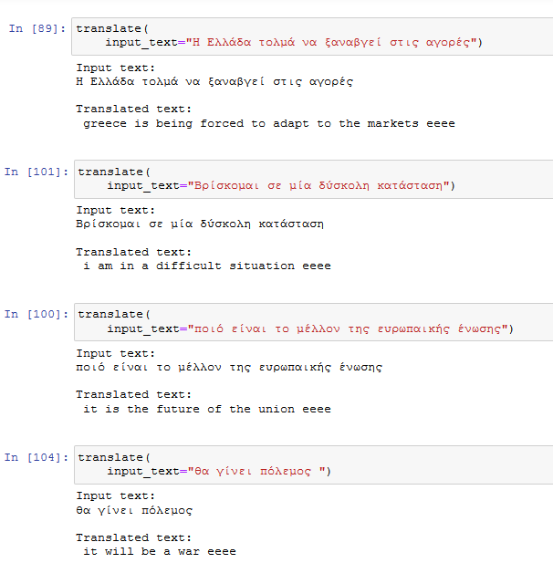

# Μετάφραση από αγγλικά σε ελληνικά

Machine translation using tensorflow.

## Introduction

Στην εποχή της παγκοσμιοποίησης, η κατανόηση, παραγωγή και επεξεργασία πολύγλωσσου περιεχομένου έχουν αυξήσει τις ανάγκες μας για μεταφραστικές υπηρεσίες.Χάρη στην πρόοδο που έχει σημειωθεί στον τομέα της πληροφορικής, κυρίως στις δεκαετίες 1980 και 1990, η καθημερινότητα των μεταφραστών είναι συνυφασμένη με τους προσωπικούς υπολογιστές και τα λογισμικά επεξεργασίας κειμένου, ενώ δίνεται μεγάλη σημασία στην ανάπτυξη συστημάτων μηχανικής μετάφρασης και μεταφραστικών εργαλείων για προσωπική ή επαγγελματική χρήση. Επιπλέον, το είδος και το μορφότυπο των προς μετάφραση εγγράφων δεν περιορίζεται στο απλό κείμενο αλλά ποικίλλει: πολυμεσικό υλικό, βίντεο, ηλεκτρονικά παιχνίδια, λογισμικά, ιστοσελίδες κτλ.

Σε αυτό το project θα προσπαθήσουμε να αναπτύξουμε ένα μοντέλο το οποίο είναι σε θέση να
μεταφράζει ελληνικές προτάσεις σε αγγλικές.  Ο κώδικας έχει γραφτεί σε γλώσσα **python** το περιβάλλον που
χρησιμοποιήθηκε είναι το **jupyter notebook**.

Πρίν προχωρήσουμε στον κώδικα καλό θα ήταν να ξεκαθαρίσουμε κάποιες βασικές έννοιες. 

## Basic

### Εξαγωγή Χαρακτηριστικών από κείμενα

Για την εφαρμογή ενός αλγορίθμου μηχανικής μάθησης, πρέπει αρχικά να κωδικοποιήσουμε τα
δεδομένα (παρατηρήσεις) σε μία αριθμητική μορφή (διανύσματα χαρακτηριστικών), η οποία στη
συνέχεια θα χρησιμοποιηθεί σαν είσοδος στον αλγόριθμο. Ο λόγος που το κάνουμε αυτό είναι επειδή
οι αλγόριθμοι μηχανικής μάθησης δεν μπορούν να καταλάβουν ούτε προτάσεις ούτε λέξεις ούτε
γράμματα το μόνο που μπορεί να καταλάβουν είναι οι αριθμοί. Η ομιλία (και ο γραπτός λόγος κατά
συνέπεια) είναι ίσως το πιο ξεχωριστό χαρακτηριστικό του ανθρώπου, σε σχέση με τα υπόλοιπα ζώα
και συνδέεται άμεσα με την ανθρώπινη συνείδηση. Στην γνωσιακή επιστήμη (cognitive science)
υπάρχουν δύο βασικές θεωρίες σε ότι αφορά τον τρόπο με τον οποίο χαρτογραφούνται οι έννοιες στον
εγκέφαλο ([Roy 2012](https://www.frontiersin.org/articles/10.3389/fpsyg.2012.00551/full) )

* **τοπική-εντοπιστική αναπαράσταση (local-localist representation)**: κάθε νευρώνας του
εγκεφάλου αντιστοιχεί σε μία και μόνο έννοια.
* **κατανεμημένη αναπαράσταση (distributed representations)**: μία έννοια αναπαρίσταται από ένα
μοτίβο δραστηριότητας πολλών νευρώνων. Δηλαδή μία έννοια χρειάζεται πολλούς νευρώνες
για να αναπαρασταθεί στον εγκέφαλο και ένας νευρώνας συμμετέχει στην αναπαράσταση
πολλών εννοιών

Οι παραπάνω θεωρίες αποτελούν ένα χρήσιμο νοητικό μοντέλο για τις διάφορες τεχνικές
αναπαράστασης της φυσικής γλώσσας, οι οποίες θα παρουσιαστούν στη συνέχεια. Στις μη
κατανεμημένες αναπαραστάσεις, μία παρατήρηση αναπαρίσταται ως το σύνολο πολλών
μονοσήμαντων χαρακτηριστικών, ενώ στις κατανεμημένες αναπαραστάσεις μία παρατήρηση
αναπαρίσταται ως σύνολο συσχετίσεων ανάμεσα σε χαρακτηριστικά.

 
Figure 1. <b>τοπική αναπαράσταση</b> – Στην τοπική αναπαράσταση (one-hot) οι λέξεις “σκύλος” και “κουτάβι” χαρτογραφούνται σε διαφορετικά διανύσματα.

 
Figure 2. <b> κατανεμημένη αναπαράσταση</b> – Στην κατανεμημένη αναπαράσταση όμως τα διανύσματά τους είναι σχεδόν ίσα, δηλαδή βρίσκονται
πολύ κοντά στον αντίστοιχο διανυσματικό χώρο.

Το βασικό πρόβλημα με τις μη κατανεμημένες αναπαραστάσεις είναι ότι δεν μπορούμε να κάνουμε καμία ουσιαστική σύγκριση μεταξύ των λέξεων παρά μόνο έλεγχο ισότητας.

### Μονοδιάστατες Αναπαραστάσεις (One-Hot)

Σε αυτού του είδους τις αναπαραστάσεις, αναπαριστούμε ένα κείμενο σαν το σύνολο των μερών του.
Αρχικά, προκαθορίζουμε ένα σύνολο χαρακτηριστικών (λέξεις, φράσεις, μέρη του λόγου κλπ.) τα οποία
μπορούν να περιγράψουν μία παρατήρηση. Σε μία απλή περίπτωση, επιλέγονται οι N (συνήθως είναι
σε τάξη μεγέθους των δεκάδων χιλιάδων) πιο συχνές λέξεις από ένα σύνολο κειμένων.Στη συνέχεια,
κατά την διαδικασία εξαγωγής του διανύσματος χαρακτηριστικών από μία παρατήρηση, ελέγχουμε τι
τιμές παίρνουν τα προεπιλεγμένα χαρακτηριστικά στην τρέχουσα παρατήρηση, όπως ποιες από τις
προκαθορισμένες λέξεις εμφανίζονται σε ένα κείμενο και πόσες φορές. Ως επακόλουθο, οι
αναπαραστάσεις αυτές, παράγουν  διανύσματα χαρακτηριστικών (sparse feature vectors), διότι
κάθε παρατήρηση έχει τιμές διάφορες του μηδέν, σε λίγες μόνο διαστάσεις του διανύσματος, καθώς
ένα κείμενο περιέχει ένα πολύ μικρό ποσοστό του συνόλου των προκαθορισμένων λέξεων

### Λεκτική ανάλυση (Tokenization)

Στην διαδικασία αυτή ένα κείμενο, μετατρέπεται από μία ακολουθία χαρακτήρων, σε μία ακολουθία
από λεκτικές μονάδες ή όρους (tokens ή terms), όπως λέξεις, σημεία στίξης, αριθμούς κλπ. Αυτό το
βήμα είναι απαραίτητο για την εκτέλεση των υπολοίπων, καθώς ενεργούν πάνω στους όρους του
κειμένου. Σε γλώσσες με το Ελληνικό ή το Λατινικό (Αγγλικά) αλφάβητο, η διαδικασία αυτή είναι πιο
απλή, καθώς οι λέξεις χωρίζονται με το κενό. Όμως, ο διαχωρισμός των λέξεων απλά στα κενά δεν
είναι πάντα αρκετός. Για παράδειγμα, τα “Νέα Ιωνία”, “εκ περιτροπής”, “εν όψει” ή στα Αγγλικά “rock ’n’
roll”, αν και αποτελούνται από πολλές λέξεις οι οποίες χωρίζονται με κενό ή ορισμένα σημεία στίξης,
αναφέρονται σε μία συγκεκριμένη έννοια και συνεπώς θα ήταν προτιμότερο να διατηρηθούν ως ένας
όρος.Αντίθετα, τα “I‘m” και “doesn‘t” αν και δεν χωρίζονται με κενό, αποτελούνται από ξεχωριστές
λέξεις-έννοιες (“I am” και “does not”).Ένας ακόμα λόγος για την σημασία της καλής λεκτικής ανάλυσης,
είναι ότι όλα τα επόμενα βήματα βασίζονται σε αυτή. Έτσι, τα όποια λάθη θα προωθηθούν στα
επόμενα βήματα της επεξεργασίας του κειμένου, αλλά και στην εξαγωγή των χαρακτηριστικών και την
δημιουργία του μοντέλου

### Διανύσματα Λέξεων (Word Embeddings)
Τα διανύσματα λέξεων γνωστά και ως word embeddings, αφορούν αναπαραστάσεις λέξεων, όπου μία
λέξη χαρτογραφείται σε ένα συνεχές διάνυσμα πραγματικών αριθμών και λίγων διαστάσεων (συνήθως
100 – 500 διαστάσεων). Ο στόχος είναι λέξεις με κοινό νόημα να χαρτογραφηθούν κοντά στον
διανυσματικό χώρο. Αναπαριστώντας μία λέξη ως ένα διάνυσμα και όχι μονοσήμαντα όπως με την
one-hot αναπαράσταση, μπορούμε να συγκρατήσουμε τις αλληλεπιδράσεις της με τις υπόλοιπες
λέξεις. Κάθε διάσταση στον διανυσματικό χώρο των λέξεων, αντιστοιχεί κατά κάποιον τρόπο σε μία
αφηρημένη έννοια και η τιμή που έχει κάθε λέξη σε μία διάσταση, αντικατοπτρίζει το βαθμό στον οποίο
σχετίζεται μαζί της.
Ο όρος word embeddings (τον οποίο συναντάμε συχνά στη βιβλιογραφία) προέρχεται από το γεγονός
ότι το διάνυσμα κάθε λέξης σχηματίζεται από τα βάρη της λέξης στο πρώτο επίπεδο του δικτύου, το
οποίο ονομάζεται και επίπεδο Εμφύτευσης (Embedding). Στα μαθηματικά εμφύτευση ονομάζεται η
διαδικασία στην οποία μία δομή χαρτογραφείται (ή προβάλλεται-ενσωματώνεται-εμφυτεύεται) από ένα
διανυσματικό χώρο σε ένα άλλο. Έτσι στην περίπτωση των λέξεων, το διάνυσμα κάθε λέξης
χαρτογραφείται από τον πολυδιάστατο αρχικό χώρο (one-hot διανύσματα), σε ένα χώρο λιγότερων
διαστάσεων.

## RNN

Ο τρόπος λειτουργίας τους μοιάζει με τον τρόπο που ο άνθρωπος επεξεργάζεται τις πληροφορίες,
δηλαδή σειριακά. Αυτή η ευελιξία, τα κάνει ιδανικά για την επεξεργασία ακολουθιών, όπως σε
προβλήματα επεξεργασίας φυσικής γλώσσας. Η βασική λειτουργία ενός RNN είναι εξαιρετικά απλή:
δέχεται ως είσοδο ένα διάνυσμα x και παράγει ως έξοδο ένα διάνυσμα y. Όμως, η κρίσιμη διαφορά
είναι ότι σε κάθε βήμα, για την παραγωγή του αποτελέσματος, λαμβάνεται υπόψη το αποτέλεσμα του
προηγούμενου βήματος.
Πιο συγκεκριμένα ένα RNN, επεξεργάζεται τα στοιχεία μίας ακολουθίας σειριακά (ένα-προς-ένα),
εκτελώντας τον ίδιο υπολογισμό, σε κάθε στοιχείο της ακολουθίας. Επίσης, διατηρεί μία εσωτερική
κατάσταση, η οποία λειτουργεί σαν ένα είδος μνήμης.

### Διάγραμμα λειτουργίας ενός RNN

Υπάρχουν δύο τρόποι ώστε να σκέφτεται κανείς το πως λειτουργεί ένα RNN.
Στην παρακάτω εικόνα φαίνεται η αναδρομική λειτουργία του RNN. Το RNN δέχεται το ένα μετά το
άλλο τα στοιχεία της ακολουθίας και ενημερώνει την εσωτερική ή κρυφή του κατάσταση.Αυτή η
εσωτερική κατάσταση χρησιμεύει ως ένα είδος μνήμης.
Η εικόνα δείχνει την αφηρημένη ιδέα ενος RNN, η οποία έχει μια εσωτερική κατάσταση που
ενημερώνεται κάθε φορά που η μονάδα λαμβάνει μια νέα εισροή.

 

H κατάσταση μνήμης μπορεί να αποθηκεύσει αυθαίρετες τιμές κινητής υποδιαστολής (αν και τυπικά
είναι περιορισμένη μεταξύ -1,0 και 1,0).Η νέα τιμή κατάστασης εξαρτάται τόσο από την παλιά τιμή
κατάστασης όσο και από την τρέχουσα είσοδο. Για παράδειγμα, αν η κατάσταση-τιμή έχει
απομνημονεύσει ότι έχουμε δει πρόσφατα τη λέξη "όχι" και η τρέχουσα είσοδος είναι "ωραία", τότε
πρέπει να αποθηκεύσουμε μια νέα κατάσταση-αξία που απομνημονεύει "όχι ωραία" που υποδηλώνει
κάτι εντελώς διαφορετικο απο το ωραία.
Ο δεύτερος τρόπος είναι αναπαράστασης το RNN με το “ξετύλιγμα” (unrolled) του δικτύου στο χρόνο.
Ας δούμε ένα συνηθισμένο παράδειγμα εφαρμογής ενός RNN στην επεξεργασία φυσικής γλώσσας.
Σε ένα πρόβλημα κατηγοριοποίησης κειμένου, το RNN επεξεργάζεται τις λέξεις του εγγράφου, τη μία
μετά την άλλη, και στο τέλος παράγει την διανυσματική αναπαράσταση του εγγράφου. Η
αναπαράσταση αυτή χρησιμοποιείται σαν διάνυσμα χαρακτηριστικών για την κατηγοριοποίηση του
κειμένου, βάση του συναισθηματικού του προσανατολισμού.Πιο συγκεκριμένα, το έγγραφο
αναπαριστάται από μία ακολουθία λέξεων. Κάθε λέξη αναπαριστάται από ένα διάνυσμα (word
embedding). Το RNN επεξεργάζεται σειριακά τις λέξεις, διατηρώντας στο εσωτερικό του, μία
περίληψη όσων έχει διαβάσει μέχρι τη χρονική στιγμή t. Στο τέλος, περιέχει την περίληψη όλης της
πληροφορίας του εγγράφου και από αυτή παράγει την τελική διανυσματική αναπαράσταση για το
έγγραφο.

 

Η αρχική κατάσταση μνήμης(first state zero) επαναφέρεται στο μηδέν εσωτερικά από το Keras /
TensorFlow κάθε φορά που αρχίζει μια νέα ακολουθία. Στο πρώτο χρονικό βήμα η λέξη "this"
εισάγεται στο RNN που χρησιμοποιεί την εσωτερική του κατάσταση (αρχικοποιημένη στο μηδέν) και
την πύλη του για τον υπολογισμό της νέας κατάστασης. Στο δεύτερο χρονικό βήμα η λέξη "είναι"
εισάγεται στο RNN που χρησιμοποιεί τώρα την εσωτερική κατάσταση που μόλις ενημερώθηκε από
την προβολή της προηγούμενης λέξης "this". Δεν υπάρχει πολύ νόημα στις λέξεις "this is" έτσι ώστε
το RNN πιθανώς να μην σώσει τίποτα σημαντικό στην εσωτερική του κατάσταση. Αλλά όταν βλέπει
την τρίτη λέξη "not", το RNN έχει μάθει ότι μπορεί να είναι σημαντική για τον προσδιορισμό του
συνολικού αισθήματος του εισερχόμενου κειμένου, οπότε πρέπει να αποθηκευτεί στην κατάσταση
μνήμης του RNN, η οποία μπορεί να χρησιμοποιηθεί αργότερα. όταν το RNN βλέπει τη λέξη "good"
στο χρονικό βήμα 6. Τέλος, όταν έχει υποστεί επεξεργασία ολόκληρη η ακολουθία, το RNN εξάγει ένα
διάνυσμα τιμών που συνοψίζει αυτό που έχει δει στην ακολουθία εισόδου. Στη συνέχεια,
χρησιμοποιούμε ένα πλήρως συνδεδεμένο στρώμα με ενεργοποίηση Sigmoid για να έχουμε μία τιμή
μεταξύ 0.0 και 1.0 την οποία ερμηνεύουμε ως αρνητικό (τιμές κοντά στο 0.0) ή θετικό (τιμές κοντά στο
1.0).

### Flowchart

Το παρακάτω διάγραμμα ροής δείχνει κατά προσέγγιση τον τρόπο κατασκευής του νευρικού δικτύου.
Το διάγραμμα είναι χωρισμένο σε δύο μέρη: Ένας κωδικοποιητής που χαρτογραφεί το πηγαίο-
κείμενο σε ένα «φορέα σκέψης» που συνοψίζει τα περιεχόμενα του κειμένου, το οποίο στη συνέχεια
εισάγεται στο δεύτερο τμήμα του νευρικού δικτύου που αποκωδικοποιεί το «φορέα σκέψης» στον
μεταφρασμένο - κείμενο.
Το νευρωνικό δίκτυο δεν μπορεί να λειτουργήσει άμεσα σε κείμενο, οπότε πρώτα πρέπει να
μετατρέψουμε κάθε λέξη σε ένα integer - token χρησιμοποιώντας έναν tokenizer. Αλλά το νευρωνικό
δίκτυο δεν μπορεί επίσης να δουλέψει σε ακέραιους αριθμούς, γι 'αυτό και χρησιμοποιούμε το
λεγόμενο Layer Embedding για να μετατρέψουμε κάθε ακέραιο σε ένα διανύσμα με τιμές κινούµενης
υποδιαστολής. Το embedding layer εκπαιδεύεται παράλληλα με το υπόλοιπο νευρωνικό δίκτυο για να
χαρτογραφήσει λέξεις με παρόμοια σημασία σε πινακες με τιμές κινούµενης υποδιαστολής.
Για παράδειγμα, η πρόταση “μία φορά και έναν καιρό” μεταφράζεται συνήθως στα αγγλικά ως "once
upon a time".
Αρχικά μετατρέπουμε ολόκληρο το σύνολο δεδομένων σε integer tokens, έτσι ώστε το κείμενο “μία
φορά και έναν καιρό” γίνεται [12, 99, 54, 555, 1097]. Καθένα από αυτά τα token χαρτογραφείται στη
συνέχεια σε ένα embedding vector με π.χ. 128 στοιχεια, ετσι ώστε το token 12 θα μπορούσε για
παράδειγμα να γίνει [0.12, -0.56, ..., 1.19]. Οι embedding vectors μπορούν στη συνέχεια να
εισάγονται στο επαναλαμβανόμενο νευρωνικό δίκτυο, το οποίο έχει 3 GRU στρώματα.
Το τελευταίο στρώμα GRU εξάγει ένα μόνο διάνυσμα τον "thought vector" που συνοψίζει τα
περιεχόμενα του πηγαίου κειμένου - ο οποίος στη συνέχεια χρησιμοποιείται ως αρχική κατάσταση
των μονάδων GRU στο τμήμα αποκωδικοποιητή.
Η πρόταση προορισμού "once upon a time" είναι γεμισμένη με ειδικούς δείκτες "ssss" και "eeee" για
να υποδείξει την αρχή και το τέλος, έτσι ώστε η ακολουθία των tokens γίνεται [2, 337, 640, 9, 79, 3] .
Κατά τη διάρκεια της εκπαίδευσης, στον αποκωδικοποιητή θα δοθεί ολόκληρη αυτή η ακολουθία ως
είσοδος και η επιθυμητή ακολουθία εξόδου είναι [337, 640, 9, 79, 3] η οποία είναι η ίδια ακολουθία
αλλά μετατοπίζεται ένα βήμα.
Προσπαθούμε να διδάξουμε τον αποκωδικοποιητή να χαρτογραφήσει το "thought vector" και το starttoken "ssss" (ακέραιο 2) στην επόμενη λέξη "once" (ακέραιο 337) και στη συνέχεια να χαρτογραφήσει
τη λέξη "once" στην επόμενη λέξη "upon" (ακέραιος αριθμός 640) και ούτω καθεξής.

 

## Examples

 

Καθοριστικό σημείο για αυτή την άσκηση ήταν η επιλογή των αριθμών των λέξεων που θα χρησιμοποιεί το μοντέλο μας ή 5.000 λέξεις είναι πολύ λίγες και αυτό φαίνεται και από το αποτέλεσμα ότι το μοντέλο πολλές λέξεις τις αγνοεί εντελώς. αλλά όπως αναφέρθηκε και πιο πάνω το να επιλεχθούν περισσότερες λέξεις θα ήταν ακόμα πιο χρονοβόρο.

## Installation

### Environment 

I use [Anaconda](https://www.anaconda.com/products/individual) because it comes with many Python
packages already installed and it is easy to work with. After installing Anaconda,
you should create a [conda environment](http://conda.pydata.org/docs/using/envs.html)
so you do not destroy your main installation in case you make a mistake somewhere:

       conda create --name machine_translation python=3.7

Now you can switch to the new environment by running the following:

      source activate machine_translation
      
### Required Packages

The Python packages that this project requires are listed in requirements.txt

To install the required Python packages and dependencies you first have to activate the conda-environment as described above, and then you run the following command in a terminal:

      pip install -r requirements.txt
